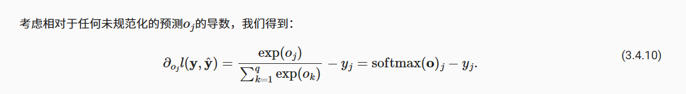

### 独热编码（one-hot encoding）
独热编码即 One-Hot 编码，又称一位有效编码，其方法是使用N位状态寄存器来对N个状态进行编码，每个状态都由他独立的寄存器位，并且在任意时候，其中只有一位有效。\
可以这样理解，对于每一个特征，如果它有m个可能值，那么经过独热编码后，就变成了m个二元特征（如成绩这个特征有好，中，差变成one-hot就是100, 010, 001）。
并且，这些特征互斥，每次只有一个激活。因此，数据会变成稀疏的。

#### softmax导数是我们softmax模型分配的概率与实际发生的情况（由独热标签向量表示）之间的差异。

