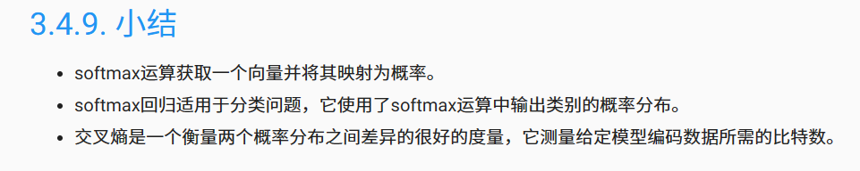
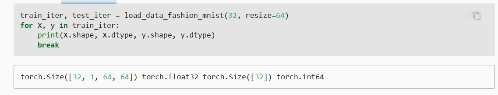

### 独热编码（one-hot encoding）
独热编码即 One-Hot 编码，又称一位有效编码，其方法是使用N位状态寄存器来对N个状态进行编码，每个状态都由他独立的寄存器位，并且在任意时候，其中只有一位有效。\
可以这样理解，对于每一个特征，如果它有m个可能值，那么经过独热编码后，就变成了m个二元特征（如成绩这个特征有好，中，差变成one-hot就是100, 010, 001）。
并且，这些特征互斥，每次只有一个激活。因此，数据会变成稀疏的。

#### softmax导数是我们softmax模型分配的概率与实际发生的情况（由独热标签向量表示）之间的差异。

### 交叉熵
我们可以从两方面来考虑交叉熵分类目标： （i）最大化观测数据的似然；（ii）最小化传达标签所需的惊异。

### Fashion-MNIST
Fashion-MNIST由10个类别的图像组成，
分别为t-shirt（T恤）、trouser（裤子）、pullover（套衫）、dress（连衣裙）、coat（外套）、
sandal（凉鞋）、shirt（衬衫）、sneaker（运动鞋）、bag（包）和ankle boot（短靴）。
 每个类别由训练数据集（train dataset）中的6000张图像 
和测试数据集（test dataset）中的1000张图像组成。 
因此，训练集和测试集分别包含60000和10000张图像。 测试数据集不会用于训练，只用于评估模型性能。

### 通道
表示图像中存储颜色信息的维度。\
灰度图像仅用不同程度的同一种颜色（灰度）来表示图像，因此其通道数为1\
RGB图像用红，绿，蓝三种颜色来表示图像，因此其通道数为2

###     train_loader = torch.utils.data.DataLoader(train_dataset,batch_size=batch_size, shuffle=True,num_workers=4)
####     关于num_workers参数的设置
* 每次dataloader加载数据时：dataloader一次性创建num_worker个worker，
（也可以说dataloader一次性创建num_worker个工作进程，worker也是普通的工作进程），
并用batch_sampler将指定batch分配给指定worker，worker将它负责的batch加载进RAM。
然后，dataloader从RAM中找本轮迭代要用的batch，如果找到了，就使用。
如果没找到，就要num_worker个worker继续加载batch到内存，直到dataloader在RAM中找到目标batch。一般情况下都是能找到的，
因为batch_sampler指定batch时当然优先指定本轮要用的batch。
* num_worker设置得大，好处是寻batch速度快，因为下一轮迭代的batch很可能在上一轮/上上一轮...迭代时已经加载好了。
坏处是内存开销大，也加重了CPU负担（worker加载数据到RAM的进程是CPU复制的嘛）。num_workers的经验设置值是自己电脑/服务器的CPU核心数，
如果CPU很强、RAM也很充足，就可以设置得更大些。
* 如果num_worker设为0，意味着每一轮迭代时，dataloader不再有自主加载数据到RAM这一步骤（因为没有worker了），
而是在RAM中找batch，找不到时再加载相应的batch。缺点当然是速度更慢。
#### 关于data.DataLoader()
这个类的实例本身不是一个迭代器，而是一个可迭代对象。因此，对于由他产生的实例只能用for循环对其中的元素进行遍历批量获取，
如果想调用next方法，首先需要使用iter方法将其转化为迭代器。

#### batch_size：表示单次传递给程序用以训练的数据（样本）个数。

