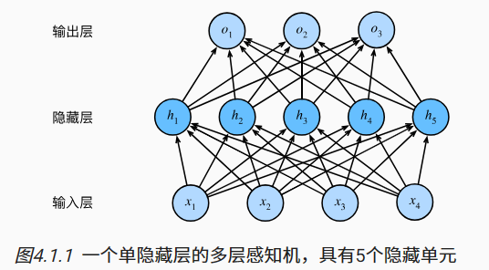
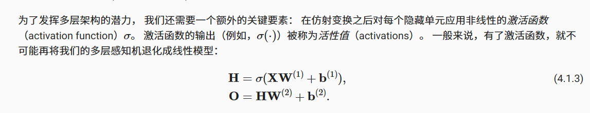
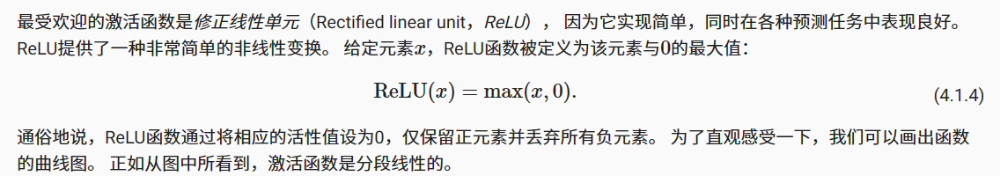
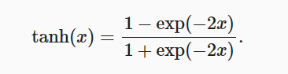

### 关于神经网络中的仿射变换
仿射变换是一种带有偏置项的线性变换。 
如softmax回归的模型架构。 该模型通过单个仿射变换将我们的输入直接映射到输出，然后进行softmax操作。 
如果我们的标签通过仿射变换后确实与我们的输入数据相关，那么这种方法确实足够了。 但是，仿射变换中的线性是一个很强的假设。\
线性意味着单调假设： 任何特征的增大都会导致模型输出的增大（如果对应的权重为正）， 或者导致模型输出的减小（如果对应的权重为负）。\

**然而我们可以很容易找出违反单调性的例子。**
**例如，我们想要根据体温预测死亡率。 对体温高于37摄氏度的人来说，温度越高风险越大。 然而，对体温低于37摄氏度的人来说，温度越高风险就越低。**

如对猫和狗的图像进行分类，增加某位置处像素的强度是否总是增加（或降低）图像描绘狗的似然？
对线性模型的依赖对应于一个隐含的假设， 即区分猫和狗的唯一要求是评估单个像素的强度。 在一个倒置图像后依然保留类别的世界里，这种方法**注定会失败。**

### 隐藏层
与我们前面的例子相比，这里的线性很荒谬， 而且我们难以通过简单的预处理来解决这个问题。 
这是因为任何像素的重要性都以复杂的方式取决于该像素的上下文（周围像素的值）。 
**我们的数据可能会有一种表示，这种表示会考虑到我们在特征之间的相关交互作用。**
在此表示的基础上建立一个线性模型可能会是合适的， 但我们不知道如何手动计算这么一种表示。 
对于深度神经网络，我们使用观测数据来联合学习隐藏层表示和应用于该表示的线性预测器。\

我们可以通过在网络中加入一个或多个隐藏层来克服线性模型的限制， 使其能处理更普遍的函数关系类型。
 要做到这一点，最简单的方法是将许多全连接层堆叠在一起。 每一层都输出到上面的层，直到生成最后的输出。
 我们可以把前L - 1层看作表示，把最后一层看作线性预测器。 这种架构通常称为多层感知机(L层指中间的隐藏层加上最后的输出层)

 
 #### 全连接层的开销
 正如我们将在后续章节中看到的，在深度学习中，全连接层无处不在。 然而，顾名思义，全连接层是“完全”连接的，可能有很多可学习的参数。 具体来说，对于任何具有
 d个输入和q个输出的全连接层， 参数开销为O(dq)，这个数字在实践中可能高得令人望而却步。
 
 
 
 #### 激活函数
 激活函数是人工神经网络中用于引入非线性因素的函数，它负责将神经元的输入映射到输出端。
 本节应用于隐藏层的激活函数通常不仅按行操作，也按元素操作。 
 这意味着在计算每一层的线性部分之后，我们可以计算每个活性值， 而不需要查看其他隐藏单元所取的值。对于大多数激活函数都是这样。
 
 虽然一个单隐层网络能学习任何函数， 但并不意味着我们应该尝试使用单隐藏层网络来解决所有问题。 
 事实上，通过使用更深（而不是更广）的网络，我们可以更容易地逼近许多函数。
\
激活函数（activation function）通过计算加权和并加上偏置来确定神经元是否应该被激活， 它们将输入信号转换为输出的可微运算。 
大多数激活函数都是非线性的。 由于激活函数是深度学习的基础，下面简要介绍一些常见的激活函数。

#### 修正线性单元（Rectified linear unit，ReLU）
给定元素x，ReLU函数被定义为该元素与0的最大值：

当输入为负时，ReLU函数的导数为0，而当输入为正时，ReLU函数的导数为1。 
这样就使得神经网络引入了非线性的成分。
注意，**当输入值精确等于0时，ReLU函数不可导。** 在此时，我们默认使用左侧的导数，即当输入为0时导数为0。 
我们可以忽略这种情况，因为输入可能永远都不会是0。 
这里引用一句古老的谚语，“如果微妙的边界条件很重要，我们很可能是在研究数学而非工程”， 这个观点正好适用于这里。

#### 挤压函数（squashing function）
它将范围（-inf, inf）中的任意输入压缩到区间（0, 1）中的某个值：

ssigmoid函数是一个平滑的、可微的阈值单元近似。 当我们想要将输出视作二元分类问题的概率时， sigmoid仍然被广泛用作输出单元上的激活函数 （sigmoid可以视为softmax的特例）。
然而，sigmoid在隐藏层中已经较少使用， 它在大部分时候被更简单、更容易训练的ReLU所取代。 
注意，当输入接近0时，sigmoid函数接近线性变换。
 
#### tanh(双曲正切)函数
与sigmoid函数类似， tanh(双曲正切)函数也能将其输入压缩转换到区间(-1, 1)上。

