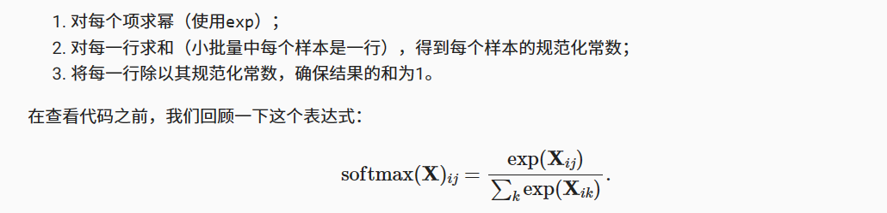
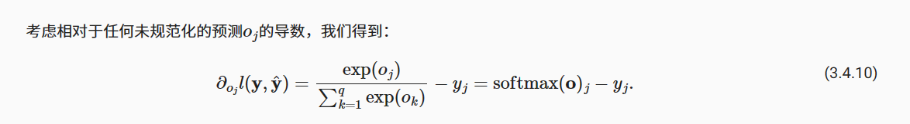
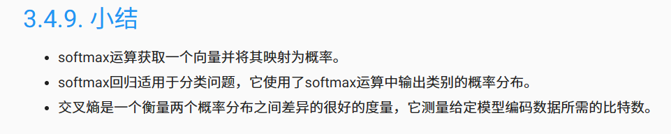
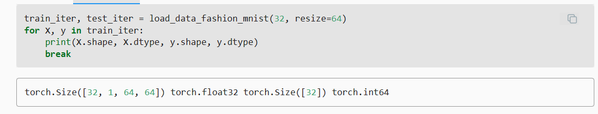

### Softmax



### 独热编码（one-hot encoding）
独热编码即 One-Hot 编码，又称一位有效编码，其方法是使用N位状态寄存器来对N个状态进行编码，每个状态都由他独立的寄存器位，并且在任意时候，其中只有一位有效。\
可以这样理解，对于每一个特征，如果它有m个可能值，那么经过独热编码后，就变成了m个二元特征（如成绩这个特征有好，中，差变成one-hot就是100, 010, 001）。
并且，这些特征互斥，每次只有一个激活。因此，数据会变成稀疏的。

#### softmax导数是我们softmax模型分配的概率与实际发生的情况（由独热标签向量表示）之间的差异。



### 交叉熵
我们可以从两方面来考虑交叉熵分类目标： （i）最大化观测数据的似然；（ii）最小化传达标签所需的惊异。



### Fashion-MNIST
Fashion-MNIST由10个类别的图像组成，
分别为t-shirt（T恤）、trouser（裤子）、pullover（套衫）、dress（连衣裙）、coat（外套）、
sandal（凉鞋）、shirt（衬衫）、sneaker（运动鞋）、bag（包）和ankle boot（短靴）。
 每个类别由训练数据集（train dataset）中的6000张图像 
和测试数据集（test dataset）中的1000张图像组成。 
因此，训练集和测试集分别包含60000和10000张图像。 测试数据集不会用于训练，只用于评估模型性能。

### 通道
表示图像中存储颜色信息的维度。\
灰度图像仅用不同程度的同一种颜色（灰度）来表示图像，因此其通道数为1\
RGB图像用红，绿，蓝三种颜色来表示图像，因此其通道数为2


###     train_loader = torch.utils.data.DataLoader(train_dataset,batch_size=batch_size, shuffle=True,num_workers=4)
####     关于num_workers参数的设置
* 每次dataloader加载数据时：dataloader一次性创建num_worker个worker，
（也可以说dataloader一次性创建num_worker个工作进程，worker也是普通的工作进程），
并用batch_sampler将指定batch分配给指定worker，worker将它负责的batch加载进RAM。
然后，dataloader从RAM中找本轮迭代要用的batch，如果找到了，就使用。
如果没找到，就要num_worker个worker继续加载batch到内存，直到dataloader在RAM中找到目标batch。一般情况下都是能找到的，
因为batch_sampler指定batch时当然优先指定本轮要用的batch。
* num_worker设置得大，好处是寻batch速度快，因为下一轮迭代的batch很可能在上一轮/上上一轮...迭代时已经加载好了。
坏处是内存开销大，也加重了CPU负担（worker加载数据到RAM的进程是CPU复制的嘛）。num_workers的经验设置值是自己电脑/服务器的CPU核心数，
如果CPU很强、RAM也很充足，就可以设置得更大些。
* 如果num_worker设为0，意味着每一轮迭代时，dataloader不再有自主加载数据到RAM这一步骤（因为没有worker了），
而是在RAM中找batch，找不到时再加载相应的batch。缺点当然是速度更慢。
#### 关于data.DataLoader()
这个类的实例本身不是一个迭代器，而是一个可迭代对象。因此，对于由他产生的实例只能用for循环对其中的元素进行遍历批量获取，
如果想调用next方法，首先需要使用iter方法将其转化为迭代器。


#### batch_size：表示单次传递给程序用以训练的数据（样本）个数。



### sum运算符
给定一个矩阵X，我们可以对所有元素求和（默认情况下）。 也可以只求同一个轴上的元素，即同一列（轴0）或同一行（轴1）。
 如果X是一个形状为(2, 3)的张量，我们对列进行求和， 则结果将是一个具有形状(3,)的向量。 
当调用sum运算符时，我们可以指定保持在原始张量的轴数，而不折叠求和的维度。 这将产生一个具有形状(1, 3)的二维张量。
```python
	X = torch.tensor([[1.0, 2.0, 3.0], [4.0, 5.0, 6.0]])
	#分别按列（轴0）求和、按行（轴1）求和，参数keepdimweitrue，即保持原有的形状
	X.sum(0, keepdim=True), X.sum(1, keepdim=True) 
```


### Pytorch的多维索引操作
对于多维张量，可以提供一个索引列表来访问特定位置的元素。
例如，y = torch.tensor([[1, 2], [3, 4]]); y[[0, 1], [1, 0]] 将返回一个张量，其中包含 y 的第一行第二列和第二行第一列的元素。


### zip函数
在Python中，基本的for循环只能迭代一个单一的可迭代对象。
如果你想在单个for循环中同时遍历两个或更多的可迭代对象，你需要使用zip函数来将它们“压缩”在一起。这样，每次迭代会产生一个由各个可迭代对象的对应元素组成的元组。


### 从零开始构建softmax的大致流程
softmax(X) ——>(应用于) net(X)

cross_entropy(y_hat, y)  损失函数（交叉熵损失）
updater(batch_size) 

accuracy(y_hat, y) ——> 
evaluate_accuracy(net, data_iter) ——> 
train_epoch_ch3(net, train_iter, loss, updater)——>
train_ch3(net, train_iter, test_iter, loss, num_epochs, updater)

predict_ch3(net, test_iter, n=6)
